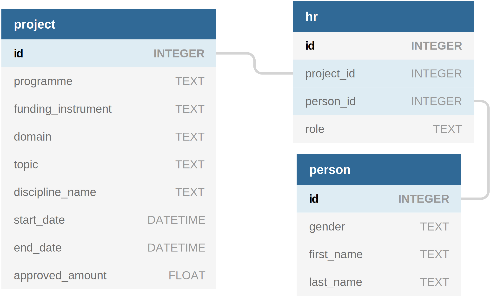

# Data Analysis of Swiss Science Funding Data

## About

The Swiss National Science Foundation (SNSF), the leading public science funding agency in Switzerland, makes its data about the projects, people, and publications [freely available online](http://p3.snf.ch/Pages/DataAndDocumentation.aspx).

This repository illustrates how Jupyter Notebooks can be used to [clean](./notebooks/cleaning.ipynb), [explore](./notebooks/exploration.ipynb), and [explain](./notebooks/slide_deck.ipynb) a subset of these data. The data subset is described as follows:

## Installation

Install [poetry](https://python-poetry.org/docs/#installation), run `poetry install` to install the dependencies, and then `make all` to run the analysis. Alternatively, you can use the `requirements.txt` file.

## License 

Distributed under the MIT License.

## Acknowledgments

 - [Poetry](https://python-poetry.org)
 - [Inkscape](https://inkscape.org)
 - [dbdiagram.io](https://dbdiagram.io)
 - [gitmoji](https://gitmoji.carloscuesta.me)
