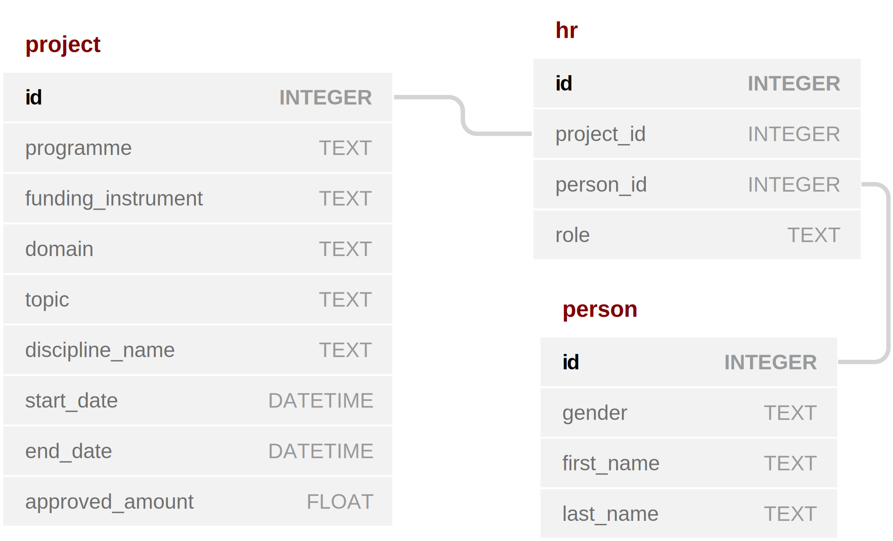

# Data Analysis of Science Funding Data

The Swiss National Science Foundation (SNSF), the leading public science funding agency in Switzerland, makes its data about the projects, people, and publications [freely availabe online](http://p3.snf.ch/Pages/DataAndDocumentation.aspx).  

This repo illustrates how Jupyter Notebooks can be used to [clean](./notebooks/cleaning.ipynb), [explore](./notebooks/exploration.ipynb), and [explain](./notebooks/slide_deck.ipynb) a subset of these data.  The data subset is described as follows:

